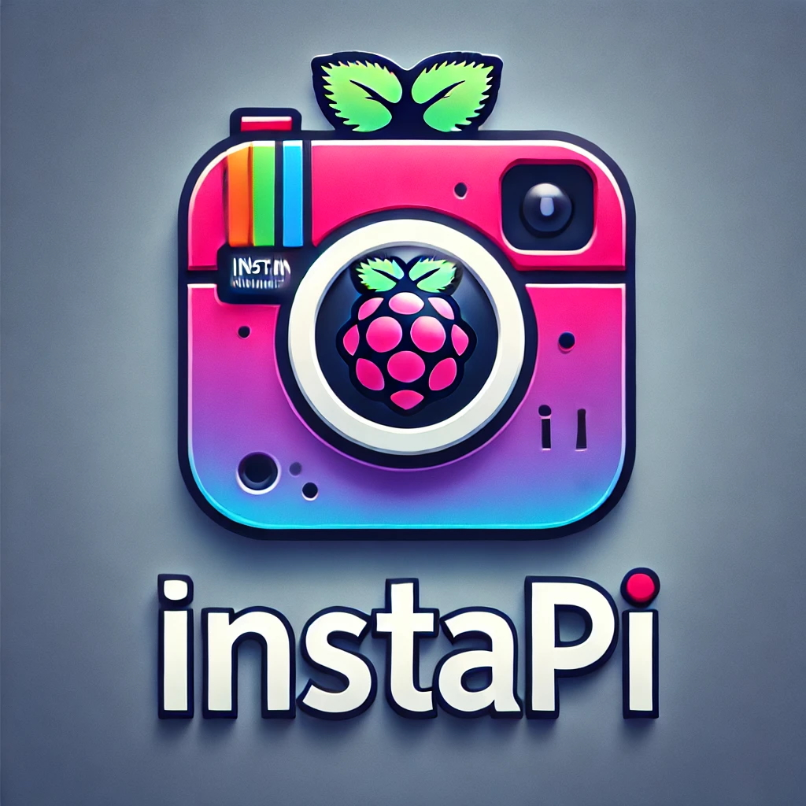

# InstaPi 📸

A simple, privacy-focused digital picture frame for Raspberry Pi. Display your Google Photos on any screen with zero data collection and no extra apps.



## Features

- **QR Code Setup** - Scan to sign in, no keyboard needed
- **Google Photos Picker** - Select exactly which photos to display
- **Privacy First** - No data collection, no third-party apps, runs locally
- **Easy Updates** - Scan the corner QR anytime to add more photos
- **Open Source** - Customize it however you want

## Display Modes

InstaPi supports two display modes, chosen during installation:

### USB Mode (Dumb Frame)
The Pi acts as a **USB mass storage device**. Connect it to any photo frame with a USB port.

- Pi creates a virtual USB drive (`~/usb_drive.img`)
- Photos are copied to this virtual drive
- Frame reads photos like a regular USB stick
- QR watermark added to photos (no persistent overlay)

### HDMI Mode (Smart Display)
The Pi connects directly to a display via **HDMI** and runs the slideshow in a browser.

- Chromium runs in kiosk mode showing the web app
- The web app IS the slideshow
- Persistent QR overlay on screen (no watermarks needed)
- Works with any HDMI monitor/TV

## Repository Structure

```
instapi/
├── app/                     # Flask application (runs on Pi)
│   ├── main.py              # Entry point
│   ├── routes/              # API routes
│   ├── templates/           # HTML templates
│   ├── static/photos/       # Downloaded photos
│   └── slideshow_config.json
├── docs/                    # GitHub Pages website
│   └── index.html
├── pi-setup/                # Raspberry Pi setup scripts
│   ├── install.sh           # Main installer
│   ├── instapi.service      # Flask app systemd service
│   ├── instapi-kiosk.service # HDMI mode: Chromium kiosk service
│   ├── usb-gadget.service   # USB mode: USB mass storage service
│   ├── kiosk.sh             # HDMI mode: Launch Chromium
│   ├── start-usb-gadget.sh  # USB mode: Start USB drive
│   ├── stop-usb-gadget.sh   # USB mode: Stop USB drive
│   ├── update-photos.sh     # USB mode: Sync photos to USB
│   ├── reset-to-setup.sh    # USB mode: Show QR on frame
│   └── generate-qr-placeholder.py
└── README.md
```

## Pi-Setup Scripts Reference

### Core Services

| Service | Mode | Description |
|---------|------|-------------|
| `instapi.service` | Both | Flask web app on port 3000 |
| `instapi-kiosk.service` | HDMI | Chromium browser in kiosk mode |
| `usb-gadget.service` | USB | USB mass storage driver |

### USB Mode Scripts

| Script | Description |
|--------|-------------|
| `start-usb-gadget.sh` | Mounts USB image, copies photos, starts USB driver |
| `stop-usb-gadget.sh` | Stops USB driver (frame disconnects briefly) |
| `update-photos.sh` | Syncs new photos from app to USB drive |
| `reset-to-setup.sh` | Clears photos, shows QR placeholder on frame |

### Manual Commands (USB Mode)

```bash
# Check USB gadget status
sudo systemctl status usb-gadget

# Manually sync photos to USB
bash ~/instapi/pi-setup/update-photos.sh

# Reset frame to show QR code
bash ~/instapi/pi-setup/reset-to-setup.sh

# Check what's on the USB drive
sudo mount -o loop ~/usb_drive.img ~/usb_mount
ls ~/usb_mount/
sudo umount ~/usb_mount
```

### Manual Commands (HDMI Mode)

```bash
# Check kiosk status
sudo systemctl status instapi-kiosk

# Restart kiosk (reload browser)
sudo systemctl restart instapi-kiosk

# Check Flask app
sudo systemctl status instapi
```

## Quick Start (Development)

```bash
git clone https://github.com/kellygold/instapi.git
cd instapi/app
python3 -m venv venv
source venv/bin/activate
pip install -r requirements.txt
cp secrets.json.template secrets.json  # Add your Google creds
python main.py
```

## Raspberry Pi Installation

```bash
curl -sSL https://raw.githubusercontent.com/kellygold/instapi/main/pi-setup/install.sh | bash
```

Or manually:
```bash
git clone https://github.com/kellygold/instapi.git
cd instapi
chmod +x pi-setup/*.sh
./pi-setup/install.sh
./pi-setup/kiosk.sh  # Optional: auto-start in fullscreen
```

## Google Cloud Setup

1. Go to [Google Cloud Console](https://console.cloud.google.com/)
2. Create a new project
3. Enable the **Photos Picker API**
4. Create OAuth 2.0 credentials (Web application)
5. Add redirect URI: `https://your-domain/oauth2callback`
6. Download and save as `app/secrets.json`

## How It Works

1. **Frame shows QR code** → Scan with phone
2. **Sign in with Google** → Authorize photo access
3. **Pick your photos** → Using Google's native picker
4. **Photos display** → Slideshow starts automatically
5. **Add more anytime** → Small QR in corner of slideshow

## Tech Stack

- **Python 3** + Flask
- **Google Photos Picker API**
- **HTML/CSS/JS** (no frontend framework)
- **Tailwind CSS** (website only)

## License

MIT - Do whatever you want with it.

---

🌐 **Website:** [instapi.dev](https://instapi.dev)

Built with frustration at expensive frames that don't work. 🖼️
