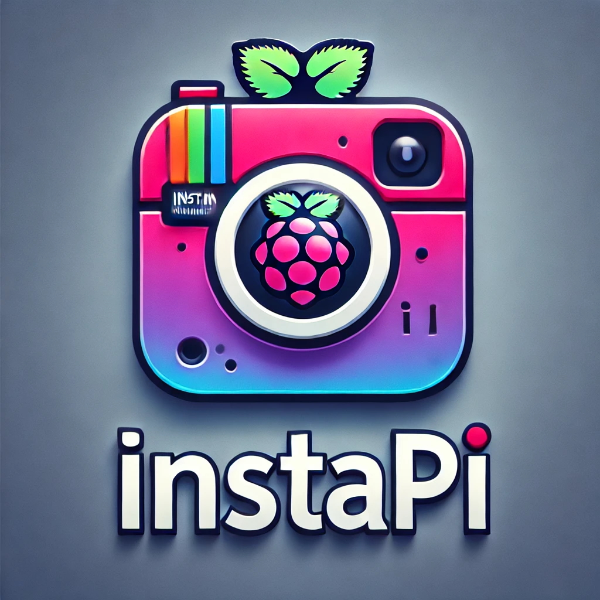

# InstaPi 📸

A fun, privacy-focused digital photo frame for Raspberry Pi. One person sets it up — everyone else just enjoys it.



## Features

- **Upload from Any Phone** — Family members scan a QR or open a link, pick photos from their camera roll, done. Works with iCloud, Google Photos, any device. No app needed.
- **Multi-Frame Family Sync** — Set up a host frame, generate tokens for family members. Child frames auto-sync photos from the host every 30 minutes. Everyone stays in sync.
- **WiFi Self-Setup** — No WiFi configured? The Pi creates an "InstaPi-Setup" hotspot with a captive portal. Pick your network, enter the password, done. Falls back to AP mode automatically if WiFi drops.
- **Over-the-Air Updates** — Tap "Update & Restart" in the admin panel. The frame pulls the latest code from GitHub and restarts. No SSH required.
- **Privacy First** — Everything runs locally on your Pi. No cloud servers, no tracking, no data collection.
- **Self-Healing** — Watchdog monitors all services every 5 minutes and auto-recovers from crashes, network drops, WiFi failures, and USB issues
- **Admin Panel** — Manage photos, slideshow settings, multi-frame sync, and system info from your phone
- **Two Display Modes** — USB (any photo frame with a USB port) or HDMI (any TV/monitor with a web-based slideshow)
- **Google Photos Picker** — Optional. Select specific photos from your Google Photos library. Requires Google Cloud setup.

## How It Works

1. **Install on your Pi** — One command, 5 minutes
2. **Connect to WiFi** — If not configured, the Pi creates a hotspot. Connect and pick your network.
3. **Scan the QR code** — Frame shows a QR on first boot
4. **Add photos** — Upload from camera roll or share the upload link with family
5. **Optional: Add family frames** — Set this Pi as the host in admin. Generate tokens for child frames. They sync automatically.

## Display Modes

### USB Mode (Dumb Frame)
Connect the Pi to any photo frame with a USB port. The Pi appears as a USB drive.
- Virtual FAT32 USB drive
- Photos synced to USB with smart reformatting (avoids frame caching issues)
- QR watermark on photos for easy admin access
- 3-second gadget delay ensures reliable frame detection

### HDMI Mode (Smart Display)
Connect the Pi to any TV or monitor via HDMI.
- Chromium kiosk mode with web-based slideshow
- Fade, slide, zoom transitions + Ken Burns effect
- Persistent QR overlay for adding photos
- Live settings updates (changes take effect within 10 seconds)

## Multi-Frame Sync

Share one photo library across multiple frames in your family.

### Host Frame (Master)
The host holds the photo library. Everyone uploads to it.
1. In the admin panel, set sync role to **Master**
2. Tap **Add Child Frame**, enter a label (e.g., "Grandma's Frame")
3. Copy the generated token

### Child Frame
Child frames pull photos from the host automatically.
1. Install InstaPi on the child Pi
2. In admin, set sync role to **Child**
3. Enter the host URL and paste the sync token
4. Photos sync automatically every 30 minutes (configurable 5–120 min)

**How sync works:** The child fetches a manifest from the host, compares MD5 checksums, and downloads only new or changed photos. Removed photos are cleaned up automatically.

## Family Sharing

The upload endpoint lets anyone add photos to the frame:

1. Owner shares the upload link (available in admin panel with copy-to-clipboard)
2. Family member opens link on their phone
3. Taps to select photos from camera roll
4. Photos upload directly to the Pi

Works from anywhere — same network or remote via ngrok. No Google account needed. Token-protected to prevent abuse.

For multi-Pi family setups, see [Multi-Frame Sync](#multi-frame-sync) above.

## Admin Panel

Access at `http://<pi-ip>:3000/admin` or via ngrok:

- **Photo Gallery** — View, delete, manage photos with thumbnail previews
- **Upload Photos** — Add from camera roll directly
- **Share with Family** — Copy the upload link to share
- **Multi-Frame Sync** — Configure host/child roles, manage child tokens, trigger manual sync
- **Slideshow Settings** — Duration (1-60s), transitions, shuffle, Ken Burns
- **Sync Frame** — Push changes to USB frame (appears after photo changes)
- **System Info** — Photo count, storage, uptime, IP address
- **Disk Warnings** — Orange/red alerts when storage is low
- **Help Guide** — Built-in guide covering all features
- **Factory Reset** — Clear everything and start fresh
- **Update & Restart** — Pull latest code from GitHub

### Slideshow Settings

| Setting | Options |
|---------|---------|
| Duration | 1-60 seconds per slide |
| Transition | Fade, Slide, Zoom |
| Ken Burns | Slow pan/zoom effect |
| Shuffle | Random photo order |

## WiFi Setup

InstaPi handles WiFi automatically:

- **First boot:** If no WiFi is configured, the Pi starts an access point (`InstaPi-Setup` at `192.168.4.1`)
- **Captive portal:** Auto-opens on iOS, Android, and Windows when you connect to the hotspot
- **Network selection:** Scan available networks, pick yours, enter password
- **Auto-recovery:** The watchdog checks connectivity and falls back to AP mode if WiFi is lost for too long

Pre-seed WiFi credentials in `instapi-setup.conf` for headless deployments.

## Installation

### Raspberry Pi

```bash
curl -sSL https://raw.githubusercontent.com/kellygold/instapi/main/pi-setup/install.sh | bash
```

The installer will ask you to choose USB or HDMI mode.

### Development

```bash
git clone https://github.com/kellygold/instapi.git
cd instapi/app
pip install -r requirements.txt
cp secrets.json.template secrets.json  # Add your Google OAuth creds (optional)
python3 main.py
```

## Google Cloud Setup (Optional)

> **Note:** InstaPi works great without Google Photos. Phone upload and family sharing cover most use cases. Only set this up if you specifically want the Google Photos picker.

1. Go to [Google Cloud Console](https://console.cloud.google.com/)
2. Create a new project
3. Enable **Photos Picker API**
4. Create OAuth 2.0 credentials (Web application)
5. Add redirect URI: `https://your-domain/oauth2callback`
6. Add scope: `photospicker.mediaitems.readonly`
7. Download credentials and save as `app/secrets.json`

## Remote Access

For remote management and family sharing, set up [ngrok](https://ngrok.com):

```bash
ngrok http 3000 --domain your-domain.ngrok.dev
```

InstaPi auto-detects ngrok URLs and configures OAuth accordingly. A systemd service (`ngrok.service`) keeps it running and auto-starts on boot.

## Self-Healing Watchdog

A cron job runs every 5 minutes checking:
- Internet connectivity (ping 8.8.8.8)
- Flask app service
- ngrok tunnel
- USB gadget (USB mode)
- Flask responsiveness
- WiFi connectivity (falls back to AP mode after repeated failures)

If anything is down, it automatically restarts it. Logs to `journalctl -t instapi-watchdog`.

## Architecture

```
instapi/
├── app/                          # Flask application
│   ├── main.py                   # Entry point + photo reconciliation
│   ├── app.py                    # Flask instance
│   ├── config.py                 # Configuration + state management
│   ├── utils.py                  # Download, watermark, USB sync
│   ├── album_sync.py             # Google Photos album sync
│   ├── routes/
│   │   ├── base_routes.py        # OAuth, QR codes, setup page
│   │   ├── picker_routes.py      # Google Photos picker flow
│   │   ├── admin_routes.py       # Admin panel + management
│   │   ├── upload_routes.py      # Family photo upload endpoint
│   │   ├── sync_routes.py        # Multi-frame host/child sync
│   │   └── wifi_routes.py        # WiFi setup + captive portal
│   ├── templates/
│   │   ├── index.html            # Setup page with QR code
│   │   ├── admin.html            # Admin panel
│   │   ├── upload.html           # Family upload page
│   │   ├── upload_error.html     # Invalid token error page
│   │   ├── slideshow.html        # HDMI slideshow
│   │   └── wifi_setup.html       # WiFi network selection
│   ├── static/
│   │   ├── photos/               # Downloaded photos
│   │   │   ├── picker/           # From Google Photos picker
│   │   │   ├── upload/           # From family uploads
│   │   │   ├── sync/             # From child frame sync
│   │   │   └── thumbs/           # 200px thumbnails for admin
│   │   ├── manifest.json         # PWA manifest (home screen icon)
│   │   └── instapi_logo_full.jpg
│   └── tests/                    # Test suite (28 tests)
├── pi-setup/                     # Raspberry Pi deployment
│   ├── install.sh                # Main installer
│   ├── watchdog.sh               # Self-healing service monitor
│   ├── instapi.service           # Flask systemd service
│   ├── instapi-kiosk.service     # HDMI kiosk service
│   ├── usb-gadget.service        # USB mass storage service
│   ├── instapi-wifi.service      # WiFi setup service
│   ├── update-photos.sh          # Sync photos to USB drive
│   ├── reset-to-setup.sh         # Factory reset USB
│   ├── start-usb-gadget.sh       # Start USB driver
│   ├── stop-usb-gadget.sh        # Stop USB driver
│   └── kiosk.sh                  # Launch Chromium kiosk
├── docs/                         # GitHub Pages (instapi.dev)
│   ├── index.html                # Landing page
│   ├── privacy.html              # Privacy policy
│   └── terms.html                # Terms of service
├── PLANNING/                     # Design specs
└── README.md
```

## Tech Stack

- **Python 3** + Flask
- **Multi-frame sync** — Manifest-based protocol with MD5 diffing
- **WiFi AP mode** — hostapd + dnsmasq with captive portal
- **Pillow** — Image processing (thumbnails, watermarks)
- **HTML/CSS/JS** — No frontend framework
- **systemd** — Service management + watchdog
- **ngrok** — Remote access tunnel
- **Google Photos Picker API** — Optional photo source

## Privacy

InstaPi runs entirely on your Raspberry Pi. There are no external servers, no analytics, no tracking. OAuth tokens exist only in your Pi's memory. Photos are stored locally and never transmitted anywhere. See our [Privacy Policy](https://instapi.dev/privacy).

## License

MIT — Do whatever you want with it.

---

🌐 **Website:** [instapi.dev](https://instapi.dev) · 📧 **Contact:** [hello@instapi.dev](mailto:hello@instapi.dev) · ☕ **Support:** [Buy Me a Coffee](https://buymeacoffee.com/jankyard)
